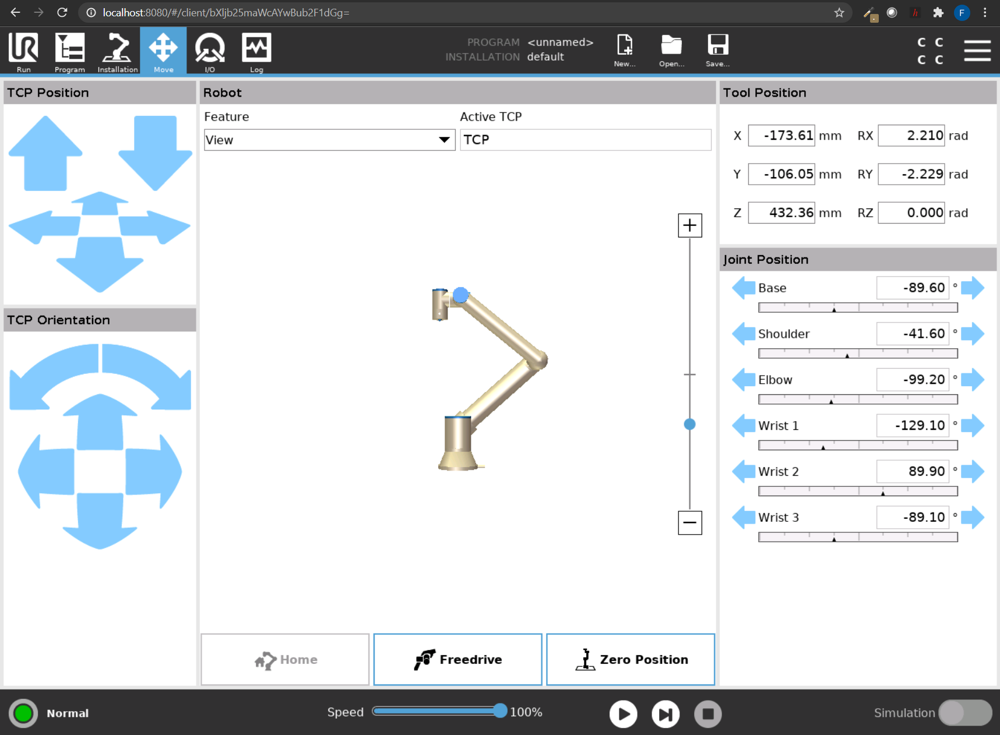

# Read_Data_From_Universal_Robots
Read Data from any Universal Robots via RTDE Interface (see more on RTDE [here](https://www.universal-robots.com/articles/ur/real-time-data-exchange-rtde-guide/)).

Works with all robots (CB>3.4 or e-series).

To receive data from a UR open read_data_from_universal_robots.py and change `ROBOT_HOST` to the IP of your robot or leave as `localhost` if you use URSim (continue reading below).
Then run the script.

## Use URSim in Docker to simulate the robot:
- install [Docker Desktop](https://www.docker.com/get-started)
- open powershell ( if on windows)
- install URSim Container ```docker pull arranhs/dockursim```
- ```docker volume create dockursim```
- create a folder on your PC where the robot programs will be stored (e.g. C:\Users\Fabian\URSIM_UR10_programs)
- copy the path (depending on Windows or Linux backslashes have to be converted to forward slash), we will use it in the next command:
- ```docker run -d --name="dockursim" -e ROBOT_MODEL=UR10 -p 8080:8080 -p 29999:29999 -p 30001-30004:30001-30004 -v C:\Users\Fabian\URSIM_UR10_programs:/ursim/programs -v dockursim:/ursim --privileged --cpus=4 arranhs/dockursim:latest```
- open any Internet Browser and type http://localhost:8080/ - here you can see the simulated robot it is accessible via the normal ports (e.g. RTDE on Port 30004)

